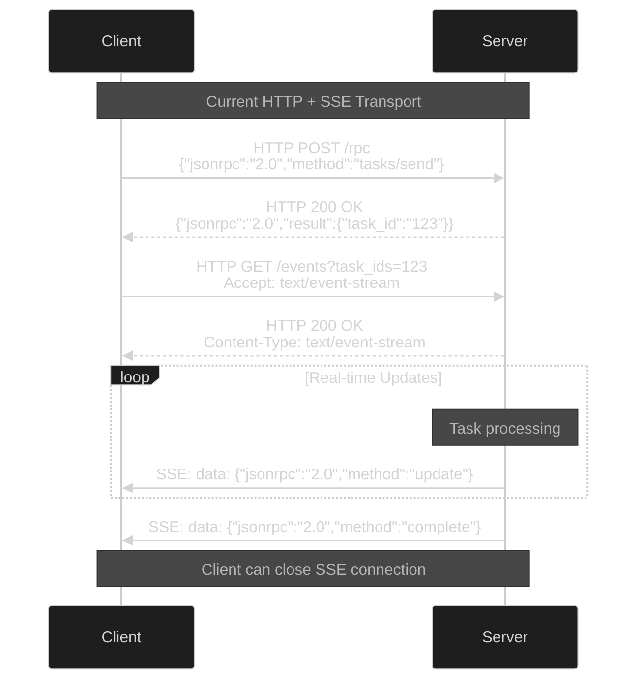
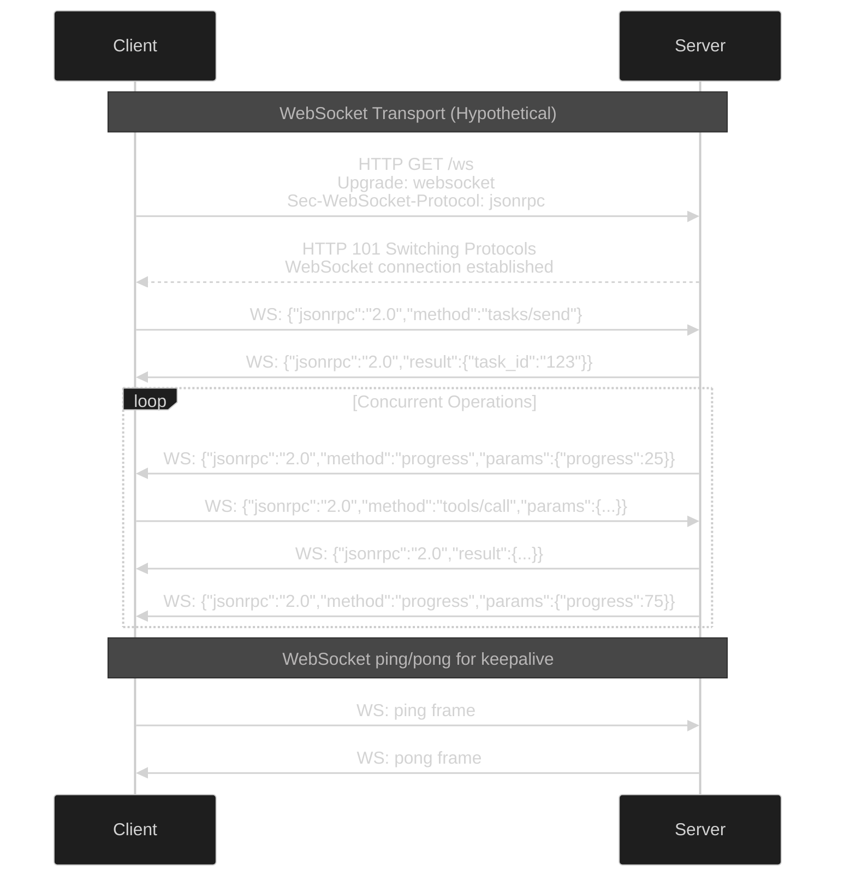
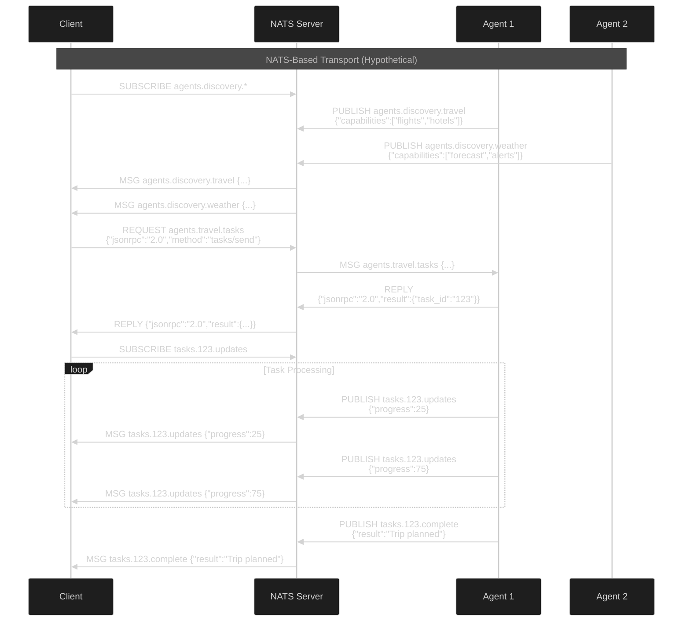

# A2A/MCP Transport Protocols: HTTP, WebSockets, gRPC, and NATS Analysis

## Transport Protocol Comparison Table

| Transport | A2A Support | MCP Support | Request/Response | Streaming | Real-time | Bidirectional | Content Types Supported | Binary Support | Complexity | Enterprise Ready |
|-----------|-------------|-------------|------------------|-----------|-----------|---------------|-------------------------|----------------|------------|------------------|
| **HTTP + SSE** | ✅ **Standard** | ✅ **Standard** | ✅ Yes | ✅ Server→Client | ✅ Yes | ⚠️ Semi | 📄 JSON, 📝 Text, 🌐 HTML, 📊 XML, 🔗 Base64 | ⚠️ Via Base64 | 🟢 Low | ✅ Yes |
| **HTTP/2** | ⚠️ Implied | ⚠️ Implied | ✅ Yes | ✅ Multiplexed | ✅ Yes | ✅ Yes | 📄 JSON, 📝 Text, 🌐 HTML, 📊 XML, 📁 Any MIME | ✅ Native Binary | 🟡 Medium | ✅ Yes |
| **WebSockets** | ❌ Not standard | ❌ Not standard | ✅ Yes | ✅ Full duplex | ✅ Yes | ✅ Yes | 📄 JSON, 📝 Text, 📁 Binary Frames | ✅ Native Binary | 🟡 Medium | ✅ Yes |
| **gRPC** | ❌ Not specified | ❌ Not specified | ✅ Yes | ✅ Bidirectional | ✅ Yes | ✅ Yes | 🔧 Protocol Buffers, 📄 JSON (via transcoding) | ✅ Native Binary | 🟡 Medium | ✅ Yes |
| **NATS** | ❌ Not specified | ❌ Not specified | ✅ Yes | ✅ Full streaming | ✅ Yes | ✅ Yes | 📄 JSON, 📝 Text, 📁 Binary, 🔧 Protobuf, 📊 Any Format | ✅ Native Binary | 🟢 Low | ✅ Yes |
| **STDIO** | ❌ No support | ✅ **Primary** | ✅ Yes | ❌ No | ❌ Local only | ✅ Yes | 📄 JSON (newline-delimited), 📝 Text | ❌ No Binary | 🟢 Very Low | ⚠️ Local only |

## Content Type Support Analysis

### HTTP + SSE (Current Standard)
**Supported Content Types:**
- ✅ `application/json` - Primary for JSON-RPC
- ✅ `text/plain` - Simple text messages
- ✅ `text/event-stream` - SSE streaming format
- ✅ `text/html` - Web content
- ✅ `application/xml` - XML data
- ⚠️ Binary data via Base64 encoding (inefficient)

**Limitations:**
- Binary data must be Base64 encoded (33% size overhead)
- No native streaming for large files
- Each HTTP request has header overhead

### HTTP/2 (Enhanced HTTP)
**Supported Content Types:**
- ✅ All HTTP/1.1 content types
- ✅ Native binary streams
- ✅ Multiplexed content types in parallel
- ✅ Server push for preloading content

**Advantages:**
- Efficient binary transfer without encoding
- Multiple content types simultaneously
- Header compression reduces overhead

### WebSockets (Full Duplex)
**Supported Content Types:**
- ✅ Text frames (UTF-8) - Perfect for JSON-RPC
- ✅ Binary frames - Raw binary data
- ✅ Custom subprotocols - Application-specific formats

**Examples:**
```javascript
// Text frame with JSON-RPC
ws.send(JSON.stringify({jsonrpc: "2.0", method: "tasks/send"}));

// Binary frame for file transfer
ws.send(new Uint8Array(fileBuffer));

// Mixed content in same connection
ws.send(JSON.stringify({type: "metadata", size: fileSize}));
ws.send(binaryData); // Followed by actual file
```

### gRPC (Protocol Buffers)
**Supported Content Types:**
- ✅ Protocol Buffers (primary) - Strongly typed, compact
- ✅ JSON via gRPC-Web transcoding
- ✅ Binary streams for large data
- ✅ Multiplexed message types

**Example Schema:**
```protobuf
service AgentService {
  rpc SendTask(TaskRequest) returns (TaskResponse);
  rpc StreamUpdates(TaskId) returns (stream TaskUpdate);
  rpc TransferFile(stream FileChunk) returns (FileResponse);
}

message TaskRequest {
  string task_id = 1;
  google.protobuf.Any payload = 2;  // Can contain any content type
  repeated FileReference files = 3;
}
```

### NATS (Message-Oriented)
**Supported Content Types:**
- ✅ JSON messages (most common)
- ✅ Protocol Buffers
- ✅ Raw binary data
- ✅ Custom serialization formats
- ✅ Message headers for metadata

**Examples:**
```go
// JSON message
nats.Publish("agents.tasks", []byte(`{"jsonrpc":"2.0","method":"send"}`))

// Binary message with headers
nats.PublishMsg(&nats.Msg{
    Subject: "files.upload",
    Header:  nats.Header{"Content-Type": []string{"application/octet-stream"}},
    Data:    binaryData,
})

// Protocol Buffers
protobufData, _ := proto.Marshal(&TaskMessage{...})
nats.Publish("agents.protobuf", protobufData)
```

### STDIO (Local Only)
**Supported Content Types:**
- ✅ JSON (newline-delimited)
- ✅ Plain text
- ❌ No binary support
- ❌ No content-type headers

**Limitation Example:**
```bash
# This works
echo '{"jsonrpc":"2.0","method":"tools/list"}' | mcp-server

# This doesn't work for binary
cat image.png | mcp-server  # ❌ Will corrupt data
```

## Content Type Implications for A2A/MCP

### Current A2A/MCP Content Handling

**Text Parts:**
```json
{
  "parts": [
    {
      "type": "text",
      "text": "Hello world"
    }
  ]
}
```

**File Parts (Current):**
```json
{
  "parts": [
    {
      "type": "image",
      "source": {
        "type": "base64",
        "media_type": "image/jpeg",
        "data": "iVBORw0KGgoAAAANSUhEUgAA..."  // 33% overhead!
      }
    }
  ]
}
```

**File References (Better):**
```json
{
  "parts": [
    {
      "type": "image",
      "source": {
        "type": "url",
        "url": "https://example.com/api/files/abc123",
        "media_type": "image/jpeg"
      }
    }
  ]
}
```

### Enhanced Transport Content Types

**WebSocket Binary Example:**
```javascript
// Send metadata as JSON
ws.send(JSON.stringify({
  jsonrpc: "2.0",
  method: "file/upload",
  params: {
    filename: "document.pdf",
    size: 1048576,
    content_type: "application/pdf"
  }
}));

// Send raw binary data
ws.send(pdfBuffer);  // No Base64 encoding needed!
```

**NATS Multi-Content Example:**
```go
// Task with mixed content types
taskMsg := &TaskMessage{
  Id: "task-123",
  TextContent: "Process this document",
  FileReferences: []string{"file://uploads/doc.pdf"},
}

// Efficient binary transfer on separate subject
nats.Publish("tasks.create", marshalJSON(taskMsg))
nats.Publish("files.doc-123", pdfBytes)
```

### 1. Standard Request/Response (HTTP)

**Current Reality:**
- **A2A**: Uses HTTP POST for requests, HTTP responses for replies
- **MCP**: Uses HTTP POST for requests, can return JSON or start SSE stream
- **Why**: Universal compatibility, well-understood, existing infrastructure

```json
// Standard HTTP Request/Response Pattern
POST /rpc HTTP/1.1
Content-Type: application/json

{"jsonrpc":"2.0","id":1,"method":"tasks/send","params":{...}}

HTTP/1.1 200 OK
Content-Type: application/json

{"jsonrpc":"2.0","id":1,"result":{...}}
```

### 2. Streaming via Server-Sent Events (Current Standard)

**Current Implementation:**
- **A2A**: Uses SSE for task progress updates and real-time notifications
- **MCP**: Uses SSE within Streamable HTTP transport for server-to-client streaming
- **Limitation**: Only server-to-client streaming, not full bidirectional

```
// SSE Stream Example
GET /events?task_ids=123 HTTP/1.1
Accept: text/event-stream

HTTP/1.1 200 OK
Content-Type: text/event-stream

data: {"jsonrpc":"2.0","method":"tasks/update","params":{"progress":50}}

data: {"jsonrpc":"2.0","method":"tasks/complete","params":{"result":"..."}}
```

### 3. WebSockets for JSON (Not Standard, But Logical)

**Potential Benefits:**
- Full bidirectional streaming
- Lower latency than HTTP + SSE
- Natural fit for real-time agent interactions
- WebSocket subprotocols could carry JSON-RPC

### 4. gRPC (High Performance Alternative)

**Potential Benefits:**
- Built-in bidirectional streaming
- Protocol buffers for efficiency
- Built-in error handling and timeouts
- HTTP/2 multiplexing

### 5. NATS (Distributed Messaging)

**Why NATS Could Be Ideal:**
- **Pub/Sub patterns** perfect for agent discovery
- **Request/Reply** built-in for JSON-RPC
- **Streaming** for real-time updates
- **Subject-based routing** for agent addressing
- **Clustering** for high availability
- **Security** with built-in authentication

## Protocol Flow Diagrams

### Current HTTP + SSE Implementation



### WebSocket Alternative (Full Bidirectional)



### NATS Pub/Sub Alternative (Distributed)



## Why Current Protocols Were Chosen

### HTTP + SSE Advantages:
1. **Universal Compatibility**: Works with all browsers, proxies, firewalls
2. **Existing Infrastructure**: No new infrastructure needed
3. **Simple Debugging**: Standard HTTP tools work
4. **Enterprise Ready**: Existing security, monitoring, load balancing
5. **Progressive Enhancement**: Start simple, add streaming as needed

### Why Not WebSockets?
1. **Proxy Issues**: Some corporate proxies block WebSockets
2. **Connection Management**: More complex reconnection logic needed
3. **Browser Limitations**: Connection limits in browsers
4. **Debugging Complexity**: Harder to debug than HTTP

### Why Not gRPC?
1. **Browser Support**: Limited browser support without grpc-web
2. **Proxy Compatibility**: Many proxies don't handle HTTP/2 well
3. **Debugging**: Requires specialized tools
4. **JSON-RPC Mismatch**: Would need protocol translation

### Why Not NATS?
1. **Infrastructure Requirement**: Requires NATS server deployment
2. **Browser Support**: No direct browser support
3. **Learning Curve**: Teams need to learn NATS concepts
4. **Over-engineering**: May be overkill for simple client-server scenarios

## Ideal Transport Protocol Recommendation

### For Current Deployments:
```
Priority 1: HTTP + SSE (Current standard)
Priority 2: WebSocket with JSON-RPC subprotocol
Priority 3: HTTP/2 with proper multiplexing
```

### For Future Distributed Systems:
```
Priority 1: NATS with JSON-RPC messages
Priority 2: gRPC with bidirectional streaming
Priority 3: WebSocket clusters with message routing
```

### For Local Development:
```
Priority 1: STDIO (MCP standard)
Priority 2: Unix Domain Sockets
Priority 3: HTTP localhost
```

## Why NATS Could Be Game-Changing

### NATS Benefits for AI Agents:

1. **Natural Agent Discovery**:
   ```
   agents.*.capabilities  → Discover all agents
   agents.travel.*        → Find travel agents
   agents.database.*      → Find data agents
   ```

2. **Scalable Request Routing**:
   ```
   tasks.high-priority    → Route to fast agents
   tasks.batch           → Route to batch processors
   tasks.gpu             → Route to GPU-enabled agents
   ```

3. **Event-Driven Architecture**:
   ```
   events.user.login     → Trigger agent workflows
   events.data.updated   → Notify interested agents
   events.system.alert   → Broadcast to monitoring agents
   ```

4. **Built-in Clustering**:
    - Automatic failover
    - Load balancing
    - Geographic distribution

**Conclusion**: While HTTP + SSE is the pragmatic choice for current implementations, NATS represents the ideal foundation for next-generation distributed AI agent systems. The choice depends on deployment complexity tolerance and scalability requirements.
