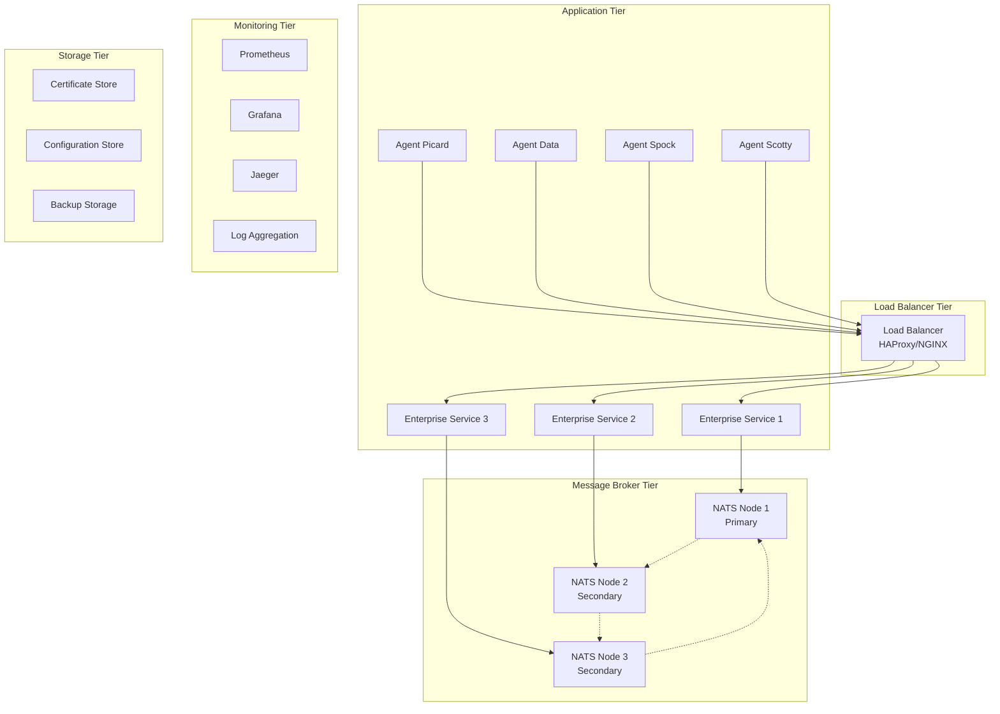

# Production Deployment Guide

> Enterprise A2A NATS with TLS - Production Best Practices
> Last Updated: 2025-07-29

## Overview

This guide provides comprehensive instructions for deploying the Qollective Enterprise A2A NATS example in production environments with enterprise-grade TLS security, high availability, monitoring, and operational best practices.

## Table of Contents

1. [Production Architecture](#production-architecture)
2. [Infrastructure Requirements](#infrastructure-requirements)
3. [Certificate Management](#certificate-management)
4. [NATS Cluster Deployment](#nats-cluster-deployment)
5. [Application Deployment](#application-deployment)
6. [Load Balancing and High Availability](#load-balancing-and-high-availability)
7. [Monitoring and Observability](#monitoring-and-observability)
8. [Security Hardening](#security-hardening)
9. [Backup and Disaster Recovery](#backup-and-disaster-recovery)
10. [Operational Procedures](#operational-procedures)

## Production Architecture

### High-Level Architecture



### Component Responsibilities

| Component | Purpose | Scaling | Critical |
|-----------|---------|---------|----------|
| Load Balancer | TLS termination, request routing | Active/Passive | Yes |
| Enterprise Services | Core business logic, agent coordination | Horizontal | Yes |
| NATS Cluster | Message brokering, event streaming | Cluster (3+ nodes) | Yes |
| Agents | Specialized processing units | Horizontal | Medium |
| Monitoring | Observability, alerting | Single/HA | Medium |
| Certificate Store | TLS certificate management | Replicated | High |

## Infrastructure Requirements

### Minimum Hardware Specifications

#### NATS Cluster Nodes (3 nodes minimum)
- **CPU**: 4 cores (8 recommended)
- **Memory**: 8 GB RAM (16 GB recommended)
- **Storage**: 100 GB SSD (for logs and persistence)
- **Network**: 1 Gbps (10 Gbps for high throughput)

#### Application Servers
- **CPU**: 2 cores (4 recommended)
- **Memory**: 4 GB RAM (8 GB recommended)
- **Storage**: 50 GB SSD
- **Network**: 1 Gbps

#### Load Balancer
- **CPU**: 2 cores
- **Memory**: 2 GB RAM
- **Storage**: 20 GB SSD
- **Network**: 1 Gbps (dedicated)

### Network Requirements

#### Port Configuration
```bash
# NATS Cluster
4443/tcp    # TLS client connections
6222/tcp    # Cluster communication
8222/tcp    # Monitoring (internal only)

# Application Services
8080/tcp    # Enterprise service API (internal)
8081/tcp    # Agent health endpoints (internal)

# Load Balancer
443/tcp     # External TLS connections
80/tcp      # HTTP redirect to HTTPS
```

#### Network Security Groups

```yaml
# Production Network Security Rules
production_security_groups:
  nats_cluster:
    ingress:
      - port: 4443
        protocol: tcp
        source: application_tier
      - port: 6222
        protocol: tcp
        source: nats_cluster
      - port: 8222
        protocol: tcp
        source: monitoring_tier
    egress:
      - port: all
        protocol: tcp
        destination: 0.0.0.0/0

  application_tier:
    ingress:
      - port: 8080-8081
        protocol: tcp
        source: load_balancer
    egress:
      - port: 4443
        protocol: tcp
        destination: nats_cluster

  load_balancer:
    ingress:
      - port: 443
        protocol: tcp
        source: 0.0.0.0/0
      - port: 80
        protocol: tcp
        source: 0.0.0.0/0
    egress:
      - port: 8080-8081
        protocol: tcp
        destination: application_tier
```

## Certificate Management

### Production Certificate Authority

#### Internal CA Setup

For internal services, establish a dedicated Certificate Authority:

```bash
#!/bin/bash
# setup-production-ca.sh

# Generate CA private key (4096-bit for production)
openssl genrsa -aes256 -out production-ca-key.pem 4096

# Generate CA certificate (valid for 10 years)
openssl req -new -x509 -days 3650 -key production-ca-key.pem \
  -out production-ca-cert.pem \
  -subj "/C=US/ST=Production/L=DataCenter/O=YourOrganization/OU=Security/CN=Production CA"

# Create CA serial number file
echo 01 > production-ca.srl

# Secure CA key
chmod 600 production-ca-key.pem
```

#### Certificate Templates

**NATS Server Certificate**:
```bash
# Generate NATS server private key
openssl genrsa -out nats-server-key.pem 4096

# Create certificate request with SAN
cat > nats-server.conf << EOF
[req]
distinguished_name = req_distinguished_name
req_extensions = v3_req
prompt = no

[req_distinguished_name]
CN = nats-production-cluster

[v3_req]
basicConstraints = CA:FALSE
keyUsage = nonRepudiation, digitalSignature, keyEncipherment
subjectAltName = @alt_names

[alt_names]
DNS.1 = nats-node-1.internal
DNS.2 = nats-node-2.internal
DNS.3 = nats-node-3.internal
DNS.4 = nats-cluster.internal
IP.1 = 10.0.1.10
IP.2 = 10.0.1.11
IP.3 = 10.0.1.12
EOF

# Generate certificate request
openssl req -new -key nats-server-key.pem -out nats-server.csr -config nats-server.conf

# Sign with production CA
openssl x509 -req -days 365 -in nats-server.csr \
  -CA production-ca-cert.pem -CAkey production-ca-key.pem \
  -CAserial production-ca.srl \
  -out nats-server-cert.pem -extensions v3_req -extfile nats-server.conf
```

**Client Certificate Template**:
```bash
# Generate client private key
openssl genrsa -out enterprise-client-key.pem 4096

# Generate client certificate
openssl req -new -key enterprise-client-key.pem -out enterprise-client.csr \
  -subj "/C=US/ST=Production/L=DataCenter/O=YourOrganization/OU=Enterprise/CN=enterprise-client"

# Sign with production CA
openssl x509 -req -days 365 -in enterprise-client.csr \
  -CA production-ca-cert.pem -CAkey production-ca-key.pem \
  -CAserial production-ca.srl \
  -out enterprise-client-cert.pem
```

### Certificate Rotation Strategy

#### Automated Certificate Rotation

```bash
#!/bin/bash
# certificate-rotation.sh

set -euo pipefail

CERT_DIR="/etc/enterprise/certs"
BACKUP_DIR="/etc/enterprise/certs/backups"
NOTIFICATION_WEBHOOK="https://alerts.company.com/webhook"

log() {
    echo "[$(date +'%Y-%m-%d %H:%M:%S')] $1" | tee -a /var/log/cert-rotation.log
}

backup_certificates() {
    local timestamp=$(date +%Y%m%d_%H%M%S)
    local backup_path="$BACKUP_DIR/$timestamp"
    
    mkdir -p "$backup_path"
    cp "$CERT_DIR"/*.pem "$backup_path/"
    log "Certificates backed up to $backup_path"
}

generate_new_certificates() {
    # Generate new certificates using templates above
    # ... (implement certificate generation logic)
    log "New certificates generated"
}

validate_certificates() {
    # Validate certificate chain
    openssl verify -CAfile "$CERT_DIR/production-ca-cert.pem" \
        "$CERT_DIR/enterprise-client-cert.pem"
    
    # Check expiration (should be > 30 days)
    local expiry_days=$(openssl x509 -in "$CERT_DIR/enterprise-client-cert.pem" \
        -noout -checkend $((30*24*60*60)) && echo "OK" || echo "SOON")
    
    if [ "$expiry_days" != "OK" ]; then
        log "ERROR: New certificate expires within 30 days"
        return 1
    fi
    
    log "Certificate validation passed"
}

restart_services() {
    # Graceful restart of services with new certificates
    systemctl reload nats-cluster
    systemctl restart enterprise-services
    log "Services restarted with new certificates"
}

send_notification() {
    local status=$1
    local message=$2
    
    curl -X POST "$NOTIFICATION_WEBHOOK" \
        -H "Content-Type: application/json" \
        -d "{\"status\": \"$status\", \"message\": \"$message\"}"
}

main() {
    log "Starting certificate rotation process"
    
    if backup_certificates && \
       generate_new_certificates && \
       validate_certificates && \
       restart_services; then
        log "Certificate rotation completed successfully"
        send_notification "success" "Certificate rotation completed"
    else
        log "ERROR: Certificate rotation failed"
        send_notification "error" "Certificate rotation failed - manual intervention required"
        exit 1
    fi
}

main "$@"
```

#### Certificate Monitoring

```bash
#!/bin/bash
# certificate-monitor.sh

CERT_DIR="/etc/enterprise/certs"
ALERT_DAYS=30

check_certificate_expiry() {
    local cert_file=$1
    local cert_name=$(basename "$cert_file" .pem)
    
    local days_until_expiry=$(openssl x509 -in "$cert_file" -noout -checkend $((ALERT_DAYS*24*60*60)) && echo "OK" || echo "EXPIRING")
    
    if [ "$days_until_expiry" = "EXPIRING" ]; then
        local expiry_date=$(openssl x509 -in "$cert_file" -noout -enddate | cut -d= -f2)
        echo "WARNING: Certificate $cert_name expires soon: $expiry_date"
        
        # Send alert
        curl -X POST "$NOTIFICATION_WEBHOOK" \
            -H "Content-Type: application/json" \
            -d "{\"alert\": \"certificate_expiry\", \"certificate\": \"$cert_name\", \"expiry_date\": \"$expiry_date\"}"
    else
        echo "OK: Certificate $cert_name is valid"
    fi
}

# Check all certificates
for cert in "$CERT_DIR"/*-cert.pem; do
    check_certificate_expiry "$cert"
done
```

## NATS Cluster Deployment

### High Availability NATS Configuration

#### Node 1 Configuration (`nats-node-1.conf`)
```conf
# NATS Node 1 - Production Configuration
server_name: nats-node-1
listen: 0.0.0.0:4443
http: 0.0.0.0:8222

# TLS Configuration
tls {
    cert_file: "/etc/nats/certs/nats-server-cert.pem"
    key_file: "/etc/nats/certs/nats-server-key.pem"
    ca_file: "/etc/nats/certs/production-ca-cert.pem"
    verify: true
    verify_and_map: true
    timeout: 5
}

# Cluster Configuration
cluster {
    name: enterprise-production
    listen: 0.0.0.0:6222
    
    tls {
        cert_file: "/etc/nats/certs/nats-server-cert.pem"
        key_file: "/etc/nats/certs/nats-server-key.pem"
        ca_file: "/etc/nats/certs/production-ca-cert.pem"
        verify: true
        timeout: 5
    }
    
    routes = [
        nats://nats-node-2.internal:6222
        nats://nats-node-3.internal:6222
    ]
}

# Performance Tuning
max_connections: 1000
max_subscriptions: 1000
max_payload: 1MB
max_pending: 64MB

# Logging
logtime: true
log_file: "/var/log/nats/nats-node-1.log"
debug: false
trace: false

# Monitoring
monitoring {
    timeout: 5s
}

# JetStream (if needed for persistence)
jetstream {
    store_dir: "/var/lib/nats/jetstream"
    max_memory: 1GB
    max_file: 10GB
}
```

#### Docker Compose for NATS Cluster

```yaml
# docker-compose.nats-cluster.yml
version: '3.8'

services:
  nats-node-1:
    image: nats:2.10-alpine
    hostname: nats-node-1.internal
    ports:
      - "4443:4443"
      - "8222:8222"
    volumes:
      - ./nats-node-1.conf:/etc/nats/nats-server.conf:ro
      - ./certs:/etc/nats/certs:ro
      - nats1-data:/var/lib/nats
      - nats1-logs:/var/log/nats
    networks:
      - nats-cluster
    restart: unless-stopped
    healthcheck:
      test: ["CMD", "wget", "--quiet", "--tries=1", "--spider", "http://localhost:8222/healthz"]
      interval: 30s
      timeout: 10s
      retries: 3
      start_period: 40s

  nats-node-2:
    image: nats:2.10-alpine
    hostname: nats-node-2.internal
    ports:
      - "4444:4443"
      - "8223:8222"
    volumes:
      - ./nats-node-2.conf:/etc/nats/nats-server.conf:ro
      - ./certs:/etc/nats/certs:ro
      - nats2-data:/var/lib/nats
      - nats2-logs:/var/log/nats
    networks:
      - nats-cluster
    restart: unless-stopped
    depends_on:
      - nats-node-1
    healthcheck:
      test: ["CMD", "wget", "--quiet", "--tries=1", "--spider", "http://localhost:8222/healthz"]
      interval: 30s
      timeout: 10s
      retries: 3
      start_period: 40s

  nats-node-3:
    image: nats:2.10-alpine
    hostname: nats-node-3.internal
    ports:
      - "4445:4443"
      - "8224:8222"
    volumes:
      - ./nats-node-3.conf:/etc/nats/nats-server.conf:ro
      - ./certs:/etc/nats/certs:ro
      - nats3-data:/var/lib/nats
      - nats3-logs:/var/log/nats
    networks:
      - nats-cluster
    restart: unless-stopped
    depends_on:
      - nats-node-1
      - nats-node-2
    healthcheck:
      test: ["CMD", "wget", "--quiet", "--tries=1", "--spider", "http://localhost:8222/healthz"]
      interval: 30s
      timeout: 10s
      retries: 3
      start_period: 40s

volumes:
  nats1-data:
  nats1-logs:
  nats2-data:
  nats2-logs:
  nats3-data:
  nats3-logs:

networks:
  nats-cluster:
    driver: bridge
    ipam:
      config:
        - subnet: 172.20.0.0/16
```

### Kubernetes Deployment

#### NATS Cluster StatefulSet

```yaml
# nats-cluster.yaml
apiVersion: v1
kind: ConfigMap
metadata:
  name: nats-config
  namespace: enterprise
data:
  nats.conf: |
    server_name: $POD_NAME
    listen: 0.0.0.0:4443
    http: 0.0.0.0:8222
    
    tls {
        cert_file: "/etc/nats/certs/tls.crt"
        key_file: "/etc/nats/certs/tls.key"
        ca_file: "/etc/nats/certs/ca.crt"
        verify: true
        verify_and_map: true
        timeout: 5
    }
    
    cluster {
        name: enterprise-production
        listen: 0.0.0.0:6222
        
        tls {
            cert_file: "/etc/nats/certs/tls.crt"
            key_file: "/etc/nats/certs/tls.key"
            ca_file: "/etc/nats/certs/ca.crt"
            verify: true
            timeout: 5
        }
        
        routes = [
            nats://nats-0.nats.enterprise.svc.cluster.local:6222
            nats://nats-1.nats.enterprise.svc.cluster.local:6222
            nats://nats-2.nats.enterprise.svc.cluster.local:6222
        ]
    }
    
    max_connections: 1000
    max_subscriptions: 1000
    max_payload: 1MB
    max_pending: 64MB
    
    logtime: true
    debug: false
    trace: false

---
apiVersion: apps/v1
kind: StatefulSet
metadata:
  name: nats
  namespace: enterprise
spec:
  serviceName: nats
  replicas: 3
  selector:
    matchLabels:
      app: nats
  template:
    metadata:
      labels:
        app: nats
    spec:
      containers:
      - name: nats
        image: nats:2.10-alpine
        ports:
        - containerPort: 4443
          name: client
        - containerPort: 8222
          name: monitoring
        - containerPort: 6222
          name: cluster
        env:
        - name: POD_NAME
          valueFrom:
            fieldRef:
              fieldPath: metadata.name
        volumeMounts:
        - name: config
          mountPath: /etc/nats/nats-server.conf
          subPath: nats.conf
        - name: certs
          mountPath: /etc/nats/certs
          readOnly: true
        livenessProbe:
          httpGet:
            path: /healthz
            port: 8222
          initialDelaySeconds: 10
          periodSeconds: 30
        readinessProbe:
          httpGet:
            path: /healthz
            port: 8222
          initialDelaySeconds: 5
          periodSeconds: 10
        resources:
          requests:
            memory: "512Mi"
            cpu: "500m"
          limits:
            memory: "1Gi"
            cpu: "1000m"
      volumes:
      - name: config
        configMap:
          name: nats-config
      - name: certs
        secret:
          secretName: nats-tls-certs

---
apiVersion: v1
kind: Service
metadata:
  name: nats
  namespace: enterprise
spec:
  clusterIP: None
  selector:
    app: nats
  ports:
  - port: 4443
    name: client
  - port: 8222
    name: monitoring
  - port: 6222
    name: cluster

---
apiVersion: v1
kind: Service
metadata:
  name: nats-client
  namespace: enterprise
spec:
  selector:
    app: nats
  ports:
  - port: 4443
    targetPort: 4443
    name: client
  type: ClusterIP
```

## Application Deployment

### Production Configuration

#### Enterprise Service Configuration

```toml
# production-config.toml
[environment]
name = "production"
log_level = "info"
metrics_enabled = true
tracing_enabled = true

[nats]
urls = [
    "nats://nats-node-1.internal:4443",
    "nats://nats-node-2.internal:4443",
    "nats://nats-node-3.internal:4443"
]
reconnect_wait_ms = 2000
max_reconnect_attempts = 10
ping_interval_ms = 30000
max_outstanding_pings = 2
connection_timeout_ms = 10000

[tls]
enabled = true
verification_mode = "MutualTls"
ca_cert_path = "/etc/enterprise/certs/production-ca-cert.pem"
cert_path = "/etc/enterprise/certs/enterprise-client-cert.pem"
key_path = "/etc/enterprise/certs/enterprise-client-key.pem"

[agents]
timeout_ms = 15000
health_check_interval_ms = 30000
registration_retry_interval_ms = 5000
max_registration_retries = 5

[security]
certificate_validation_enabled = true
crew_roster_validation_enabled = true
security_clearance_required = true
max_validation_cache_size = 10000
validation_cache_ttl_seconds = 3600

[monitoring]
metrics_port = 9090
health_check_port = 8081
prometheus_enabled = true
jaeger_enabled = true
jaeger_endpoint = "http://jaeger-collector:14268/api/traces"

[logging]
level = "info"
format = "json"
output = "stdout"
file_rotation = true
max_file_size_mb = 100
max_files = 10
```

#### Dockerfile for Production

```dockerfile
# Dockerfile.production
FROM rust:1.75-alpine as builder

# Install build dependencies
RUN apk add --no-cache musl-dev openssl-dev

# Set working directory
WORKDIR /usr/src/app

# Copy dependency manifests
COPY Cargo.toml Cargo.lock ./
COPY software/examples/qollective_a2a_q_console_challenge/Cargo.toml ./software/examples/qollective_a2a_q_console_challenge/

# Copy source code
COPY . .

# Build release binary
WORKDIR /usr/src/app/software/examples/qollective_a2a_q_console_challenge
RUN cargo build --release --bin enterprise

# Production image
FROM alpine:3.18

# Install runtime dependencies
RUN apk add --no-cache ca-certificates openssl

# Create app user
RUN addgroup -g 1001 -S enterprise && \
    adduser -u 1001 -S enterprise -G enterprise

# Create directories
RUN mkdir -p /app/bin /app/config /app/certs /app/logs && \
    chown -R enterprise:enterprise /app

# Copy binary
COPY --from=builder /usr/src/app/software/examples/qollective_a2a_q_console_challenge/target/release/enterprise /app/bin/

# Copy configuration template
COPY --from=builder /usr/src/app/software/examples/qollective_a2a_q_console_challenge/production-config.toml /app/config/

# Set permissions
RUN chmod +x /app/bin/enterprise && \
    chown enterprise:enterprise /app/bin/enterprise

# Switch to app user
USER enterprise

# Set working directory
WORKDIR /app

# Expose ports
EXPOSE 8080 8081 9090

# Health check
HEALTHCHECK --interval=30s --timeout=10s --start-period=5s --retries=3 \
    CMD wget --quiet --tries=1 --spider http://localhost:8081/health || exit 1

# Start application
CMD ["/app/bin/enterprise", "--config", "/app/config/production-config.toml"]
```

#### Kubernetes Deployment

```yaml
# enterprise-deployment.yaml
apiVersion: apps/v1
kind: Deployment
metadata:
  name: enterprise-service
  namespace: enterprise
  labels:
    app: enterprise-service
    version: v1.0.0
spec:
  replicas: 3
  selector:
    matchLabels:
      app: enterprise-service
  template:
    metadata:
      labels:
        app: enterprise-service
        version: v1.0.0
      annotations:
        prometheus.io/scrape: "true"
        prometheus.io/port: "9090"
        prometheus.io/path: "/metrics"
    spec:
      serviceAccountName: enterprise-service
      containers:
      - name: enterprise
        image: enterprise/qollective-enterprise:v1.0.0
        imagePullPolicy: IfNotPresent
        ports:
        - containerPort: 8080
          name: api
          protocol: TCP
        - containerPort: 8081
          name: health
          protocol: TCP
        - containerPort: 9090
          name: metrics
          protocol: TCP
        env:
        - name: RUST_LOG
          value: "info"
        - name: CONFIG_PATH
          value: "/app/config/production-config.toml"
        volumeMounts:
        - name: config
          mountPath: /app/config
          readOnly: true
        - name: certs
          mountPath: /etc/enterprise/certs
          readOnly: true
        livenessProbe:
          httpGet:
            path: /health
            port: 8081
          initialDelaySeconds: 30
          periodSeconds: 30
          timeoutSeconds: 10
          failureThreshold: 3
        readinessProbe:
          httpGet:
            path: /ready
            port: 8081
          initialDelaySeconds: 5
          periodSeconds: 10
          timeoutSeconds: 5
          failureThreshold: 3
        resources:
          requests:
            memory: "256Mi"
            cpu: "250m"
          limits:
            memory: "512Mi"
            cpu: "500m"
        securityContext:
          allowPrivilegeEscalation: false
          runAsNonRoot: true
          runAsUser: 1001
          readOnlyRootFilesystem: true
          capabilities:
            drop:
            - ALL
      volumes:
      - name: config
        configMap:
          name: enterprise-config
      - name: certs
        secret:
          secretName: enterprise-tls-certs
          defaultMode: 0600

---
apiVersion: v1
kind: Service
metadata:
  name: enterprise-service
  namespace: enterprise
  labels:
    app: enterprise-service
spec:
  selector:
    app: enterprise-service
  ports:
  - port: 8080
    targetPort: 8080
    name: api
  - port: 8081
    targetPort: 8081
    name: health
  - port: 9090
    targetPort: 9090
    name: metrics
  type: ClusterIP

---
apiVersion: v1
kind: ServiceAccount
metadata:
  name: enterprise-service
  namespace: enterprise
```

## Load Balancing and High Availability

### HAProxy Configuration

```cfg
# haproxy.cfg - Production Load Balancer
global
    daemon
    maxconn 4096
    log stdout local0 info
    
    # TLS Configuration
    ssl-default-bind-ciphers ECDHE+AESGCM:ECDHE+CHACHA20:RSA+AESGCM:RSA+AES:!aNULL:!MD5:!DSS
    ssl-default-bind-options ssl-min-ver TLSv1.2 no-tls-tickets
    ssl-default-server-ciphers ECDHE+AESGCM:ECDHE+CHACHA20:RSA+AESGCM:RSA+AES:!aNULL:!MD5:!DSS
    ssl-default-server-options ssl-min-ver TLSv1.2 no-tls-tickets

defaults
    mode http
    log global
    option httplog
    option dontlognull
    option log-health-checks
    option redispatch
    retries 3
    timeout connect 5000ms
    timeout client 50000ms
    timeout server 50000ms

# Frontend for NATS TLS connections
frontend nats_tls_frontend
    bind *:4443 ssl crt /etc/haproxy/certs/haproxy.pem ca-file /etc/haproxy/certs/ca.pem verify required
    mode tcp
    default_backend nats_cluster

# Backend for NATS cluster
backend nats_cluster
    mode tcp
    balance roundrobin
    option tcp-check
    
    server nats-1 nats-node-1.internal:4443 check ssl verify required ca-file /etc/haproxy/certs/ca.pem crt /etc/haproxy/certs/client.pem
    server nats-2 nats-node-2.internal:4443 check ssl verify required ca-file /etc/haproxy/certs/ca.pem crt /etc/haproxy/certs/client.pem
    server nats-3 nats-node-3.internal:4443 check ssl verify required ca-file /etc/haproxy/certs/ca.pem crt /etc/haproxy/certs/client.pem

# Frontend for Enterprise API
frontend enterprise_api_frontend
    bind *:443 ssl crt /etc/haproxy/certs/haproxy.pem
    bind *:80
    redirect scheme https if !{ ssl_fc }
    
    # Security headers
    http-response set-header Strict-Transport-Security "max-age=31536000; includeSubDomains"
    http-response set-header X-Content-Type-Options nosniff
    http-response set-header X-Frame-Options DENY
    http-response set-header X-XSS-Protection "1; mode=block"
    
    default_backend enterprise_services

# Backend for Enterprise services
backend enterprise_services
    balance roundrobin
    option httpchk GET /health
    http-check expect status 200
    
    server enterprise-1 enterprise-service-1.internal:8080 check
    server enterprise-2 enterprise-service-2.internal:8080 check
    server enterprise-3 enterprise-service-3.internal:8080 check

# Statistics interface
listen stats
    bind *:8404
    stats enable
    stats uri /stats
    stats refresh 30s
    stats admin if TRUE
```

### NGINX Alternative Configuration

```nginx
# nginx.conf - Alternative Load Balancer
upstream nats_cluster {
    least_conn;
    server nats-node-1.internal:4443 max_fails=3 fail_timeout=30s;
    server nats-node-2.internal:4443 max_fails=3 fail_timeout=30s;
    server nats-node-3.internal:4443 max_fails=3 fail_timeout=30s;
}

upstream enterprise_services {
    least_conn;
    server enterprise-service-1.internal:8080 max_fails=3 fail_timeout=30s;
    server enterprise-service-2.internal:8080 max_fails=3 fail_timeout=30s;
    server enterprise-service-3.internal:8080 max_fails=3 fail_timeout=30s;
}

# NATS TLS Proxy
stream {
    server {
        listen 4443 ssl;
        ssl_certificate /etc/nginx/certs/server.crt;
        ssl_certificate_key /etc/nginx/certs/server.key;
        ssl_client_certificate /etc/nginx/certs/ca.crt;
        ssl_verify_client on;
        ssl_protocols TLSv1.2 TLSv1.3;
        
        proxy_pass nats_cluster;
        proxy_timeout 1s;
        proxy_responses 1;
        proxy_bind $remote_addr transparent;
    }
}

# HTTP/HTTPS Proxy
http {
    # Security headers
    add_header Strict-Transport-Security "max-age=31536000; includeSubDomains" always;
    add_header X-Content-Type-Options nosniff always;
    add_header X-Frame-Options DENY always;
    add_header X-XSS-Protection "1; mode=block" always;
    
    server {
        listen 80;
        return 301 https://$server_name$request_uri;
    }
    
    server {
        listen 443 ssl http2;
        ssl_certificate /etc/nginx/certs/server.crt;
        ssl_certificate_key /etc/nginx/certs/server.key;
        ssl_protocols TLSv1.2 TLSv1.3;
        
        location / {
            proxy_pass http://enterprise_services;
            proxy_set_header Host $host;
            proxy_set_header X-Real-IP $remote_addr;
            proxy_set_header X-Forwarded-For $proxy_add_x_forwarded_for;
            proxy_set_header X-Forwarded-Proto $scheme;
            
            # Health check
            health_check uri=/health expected=200;
        }
        
        location /metrics {
            proxy_pass http://enterprise_services;
            allow 10.0.0.0/8;  # Internal monitoring only
            deny all;
        }
    }
}
```

## Monitoring and Observability

### Prometheus Configuration

```yaml
# prometheus.yml
global:
  scrape_interval: 15s
  evaluation_interval: 15s

rule_files:
  - "enterprise_rules.yml"

alerting:
  alertmanagers:
    - static_configs:
        - targets:
          - alertmanager:9093

scrape_configs:
  # NATS monitoring
  - job_name: 'nats'
    static_configs:
      - targets: 
        - 'nats-node-1.internal:8222'
        - 'nats-node-2.internal:8222'
        - 'nats-node-3.internal:8222'
    metrics_path: '/varz'
    scrape_interval: 10s

  # Enterprise services
  - job_name: 'enterprise-services'
    static_configs:
      - targets:
        - 'enterprise-service-1.internal:9090'
        - 'enterprise-service-2.internal:9090'
        - 'enterprise-service-3.internal:9090'
    scrape_interval: 15s

  # HAProxy metrics
  - job_name: 'haproxy'
    static_configs:
      - targets: ['haproxy:8404']
    metrics_path: '/stats/prometheus'
    scrape_interval: 15s
```

### Alert Rules

```yaml
# enterprise_rules.yml
groups:
- name: enterprise.rules
  rules:
  # NATS cluster health
  - alert: NATSNodeDown
    expr: up{job="nats"} == 0
    for: 30s
    labels:
      severity: critical
    annotations:
      summary: "NATS node {{ $labels.instance }} is down"
      description: "NATS node {{ $labels.instance }} has been down for more than 30 seconds."

  - alert: NATSHighConnectionCount
    expr: nats_varz_connections > 800
    for: 5m
    labels:
      severity: warning
    annotations:
      summary: "High connection count on NATS node {{ $labels.instance }}"
      description: "NATS node {{ $labels.instance }} has {{ $value }} connections (>800)."

  # TLS certificate expiry
  - alert: TLSCertificateExpiringSoon
    expr: (cert_expiry_days < 30)
    for: 1h
    labels:
      severity: warning
    annotations:
      summary: "TLS certificate expiring soon"
      description: "TLS certificate {{ $labels.cert_name }} expires in {{ $value }} days."

  - alert: TLSCertificateExpiredOrExpiringSoon
    expr: (cert_expiry_days < 7)
    for: 5m
    labels:
      severity: critical
    annotations:
      summary: "TLS certificate expired or expiring very soon"
      description: "TLS certificate {{ $labels.cert_name }} expires in {{ $value }} days."

  # Enterprise service health
  - alert: EnterpriseServiceDown
    expr: up{job="enterprise-services"} == 0
    for: 30s
    labels:
      severity: critical
    annotations:
      summary: "Enterprise service {{ $labels.instance }} is down"
      description: "Enterprise service {{ $labels.instance }} has been down for more than 30 seconds."

  - alert: EnterpriseServiceHighErrorRate
    expr: rate(http_requests_total{status=~"5.."}[5m]) > 0.1
    for: 5m
    labels:
      severity: warning
    annotations:
      summary: "High error rate on enterprise service {{ $labels.instance }}"
      description: "Enterprise service {{ $labels.instance }} has error rate {{ $value }} (>10%)."

  # Agent registration failures
  - alert: AgentRegistrationFailures
    expr: rate(agent_registration_failures_total[5m]) > 0.5
    for: 2m
    labels:
      severity: warning
    annotations:
      summary: "High agent registration failure rate"
      description: "Agent registration failure rate is {{ $value }} per second (>0.5/s)."
```

### Grafana Dashboards

#### NATS Cluster Dashboard

```json
{
  "dashboard": {
    "title": "NATS Cluster - Enterprise Production",
    "panels": [
      {
        "title": "NATS Cluster Status",
        "type": "stat",
        "targets": [
          {
            "expr": "sum(up{job=\"nats\"})",
            "legendFormat": "Healthy Nodes"
          }
        ]
      },
      {
        "title": "Connection Count",
        "type": "graph",
        "targets": [
          {
            "expr": "nats_varz_connections",
            "legendFormat": "{{ instance }}"
          }
        ]
      },
      {
        "title": "Message Rates",
        "type": "graph",
        "targets": [
          {
            "expr": "rate(nats_varz_total_msgs[5m])",
            "legendFormat": "Messages/sec - {{ instance }}"
          }
        ]
      },
      {
        "title": "TLS Connections",
        "type": "graph",
        "targets": [
          {
            "expr": "nats_varz_tls_connections",
            "legendFormat": "TLS Connections - {{ instance }}"
          }
        ]
      }
    ]
  }
}
```

#### Enterprise Services Dashboard

```json
{
  "dashboard": {
    "title": "Enterprise Services - Production",
    "panels": [
      {
        "title": "Service Health",
        "type": "stat",
        "targets": [
          {
            "expr": "sum(up{job=\"enterprise-services\"})",
            "legendFormat": "Healthy Services"
          }
        ]
      },
      {
        "title": "Request Rate",
        "type": "graph",
        "targets": [
          {
            "expr": "rate(http_requests_total[5m])",
            "legendFormat": "{{ instance }} - {{ method }}"
          }
        ]
      },
      {
        "title": "Error Rate",
        "type": "graph",
        "targets": [
          {
            "expr": "rate(http_requests_total{status=~\"5..\"}[5m])",
            "legendFormat": "{{ instance }} - 5xx errors"
          }
        ]
      },
      {
        "title": "Agent Registration Success Rate",
        "type": "graph",
        "targets": [
          {
            "expr": "rate(agent_registrations_successful_total[5m])",
            "legendFormat": "Successful registrations/sec"
          }
        ]
      },
      {
        "title": "Certificate Validation Status",
        "type": "graph",
        "targets": [
          {
            "expr": "certificate_validations_total",
            "legendFormat": "{{ result }} - {{ instance }}"
          }
        ]
      }
    ]
  }
}
```

### Distributed Tracing with Jaeger

```yaml
# jaeger-deployment.yaml
apiVersion: apps/v1
kind: Deployment
metadata:
  name: jaeger
  namespace: enterprise
spec:
  replicas: 1
  selector:
    matchLabels:
      app: jaeger
  template:
    metadata:
      labels:
        app: jaeger
    spec:
      containers:
      - name: jaeger
        image: jaegertracing/all-in-one:latest
        ports:
        - containerPort: 14268
          name: collector
        - containerPort: 16686
          name: ui
        env:
        - name: COLLECTOR_ZIPKIN_HTTP_PORT
          value: "9411"
        - name: SPAN_STORAGE_TYPE
          value: "elasticsearch"
        - name: ES_SERVER_URLS
          value: "http://elasticsearch:9200"

---
apiVersion: v1
kind: Service
metadata:
  name: jaeger
  namespace: enterprise
spec:
  selector:
    app: jaeger
  ports:
  - port: 14268
    name: collector
  - port: 16686
    name: ui
```

## Security Hardening

### Network Security

#### Firewall Rules (iptables)

```bash
#!/bin/bash
# firewall-rules.sh

# Flush existing rules
iptables -F
iptables -X
iptables -t nat -F
iptables -t nat -X

# Default policies
iptables -P INPUT DROP
iptables -P FORWARD DROP
iptables -P OUTPUT ACCEPT

# Allow loopback
iptables -A INPUT -i lo -j ACCEPT
iptables -A OUTPUT -o lo -j ACCEPT

# Allow established connections
iptables -A INPUT -m conntrack --ctstate ESTABLISHED,RELATED -j ACCEPT

# SSH access (restrict to management network)
iptables -A INPUT -p tcp --dport 22 -s 10.0.0.0/8 -j ACCEPT

# NATS TLS (from application tier)
iptables -A INPUT -p tcp --dport 4443 -s 10.1.0.0/24 -j ACCEPT

# NATS cluster communication (from NATS nodes)
iptables -A INPUT -p tcp --dport 6222 -s 10.2.0.0/24 -j ACCEPT

# NATS monitoring (from monitoring tier)
iptables -A INPUT -p tcp --dport 8222 -s 10.3.0.0/24 -j ACCEPT

# Application API (from load balancer)
iptables -A INPUT -p tcp --dport 8080 -s 10.4.0.0/24 -j ACCEPT

# Health checks (from load balancer)
iptables -A INPUT -p tcp --dport 8081 -s 10.4.0.0/24 -j ACCEPT

# Metrics (from monitoring)
iptables -A INPUT -p tcp --dport 9090 -s 10.3.0.0/24 -j ACCEPT

# HTTPS (from anywhere)
iptables -A INPUT -p tcp --dport 443 -j ACCEPT

# HTTP redirect
iptables -A INPUT -p tcp --dport 80 -j ACCEPT

# Log dropped packets
iptables -A INPUT -j LOG --log-prefix "DROPPED: "

# Save rules
iptables-save > /etc/iptables/rules.v4
```

#### Security Groups (AWS)

```yaml
# security-groups.yaml
SecurityGroups:
  NATSClusterSG:
    Type: AWS::EC2::SecurityGroup
    Properties:
      GroupDescription: NATS Cluster Security Group
      VpcId: !Ref VPC
      SecurityGroupIngress:
        - IpProtocol: tcp
          FromPort: 4443
          ToPort: 4443
          SourceSecurityGroupId: !Ref ApplicationTierSG
          Description: NATS TLS from application tier
        - IpProtocol: tcp
          FromPort: 6222
          ToPort: 6222
          SourceSecurityGroupId: !Ref NATSClusterSG
          Description: NATS cluster communication
        - IpProtocol: tcp
          FromPort: 8222
          ToPort: 8222
          SourceSecurityGroupId: !Ref MonitoringSG
          Description: NATS monitoring from monitoring tier

  ApplicationTierSG:
    Type: AWS::EC2::SecurityGroup
    Properties:
      GroupDescription: Application Tier Security Group
      VpcId: !Ref VPC
      SecurityGroupIngress:
        - IpProtocol: tcp
          FromPort: 8080
          ToPort: 8081
          SourceSecurityGroupId: !Ref LoadBalancerSG
          Description: API and health checks from load balancer
        - IpProtocol: tcp
          FromPort: 9090
          ToPort: 9090
          SourceSecurityGroupId: !Ref MonitoringSG
          Description: Metrics from monitoring

  LoadBalancerSG:
    Type: AWS::EC2::SecurityGroup
    Properties:
      GroupDescription: Load Balancer Security Group
      VpcId: !Ref VPC
      SecurityGroupIngress:
        - IpProtocol: tcp
          FromPort: 443
          ToPort: 443
          CidrIp: 0.0.0.0/0
          Description: HTTPS from anywhere
        - IpProtocol: tcp
          FromPort: 80
          ToPort: 80
          CidrIp: 0.0.0.0/0
          Description: HTTP redirect
```

### Application Security

#### Security Configuration

```toml
# security-hardening.toml
[security]
# Certificate validation
certificate_validation_enabled = true
certificate_chain_validation = true
certificate_revocation_checking = true
certificate_transparency_checking = false  # Enable for public CAs

# Authentication
require_client_certificates = true
enforce_certificate_expiry = true
certificate_grace_period_hours = 24

# Authorization
crew_roster_validation_enabled = true
security_clearance_required = true
capability_validation_enabled = true

# Network security
tls_min_version = "1.2"
tls_max_version = "1.3"
cipher_suites = ["TLS_AES_256_GCM_SHA384", "TLS_CHACHA20_POLY1305_SHA256", "TLS_AES_128_GCM_SHA256"]
require_perfect_forward_secrecy = true

# Rate limiting
max_connections_per_ip = 100
max_requests_per_minute = 1000
max_registration_attempts_per_minute = 10

# Input validation
max_agent_name_length = 255
max_capability_count = 50
max_metadata_size_bytes = 8192
max_message_size_bytes = 1048576  # 1MB

# Audit logging
audit_logging_enabled = true
audit_log_level = "info"
audit_sensitive_data = false
```

#### Container Security

```dockerfile
# Security-hardened Dockerfile
FROM rust:1.75-alpine as builder

# Security: Run as non-root during build
RUN addgroup -g 1001 -S builder && \
    adduser -u 1001 -S builder -G builder
USER builder

# ... build steps ...

FROM alpine:3.18

# Security: Install only necessary packages
RUN apk add --no-cache ca-certificates openssl && \
    rm -rf /var/cache/apk/*

# Security: Create non-root user
RUN addgroup -g 1001 -S enterprise && \
    adduser -u 1001 -S enterprise -G enterprise

# Security: Set up directories with proper permissions
RUN mkdir -p /app/bin /app/config /app/certs /app/logs && \
    chown -R enterprise:enterprise /app && \
    chmod 755 /app && \
    chmod 700 /app/certs

COPY --from=builder --chown=enterprise:enterprise /usr/src/app/target/release/enterprise /app/bin/

# Security: Run as non-root
USER enterprise

# Security: Read-only root filesystem
# Mount writable volumes for logs and temporary files
VOLUME ["/app/logs", "/tmp"]

# Security: Drop all capabilities
# Enable only required capabilities in deployment

# Security: No shell in production
ENTRYPOINT ["/app/bin/enterprise"]
```

### Secrets Management

#### Kubernetes Secrets

```yaml
# Create TLS certificates secret
apiVersion: v1
kind: Secret
metadata:
  name: enterprise-tls-certs
  namespace: enterprise
type: Opaque
data:
  ca.crt: LS0tLS1CRUdJTi... # base64 encoded CA certificate
  tls.crt: LS0tLS1CRUdJTi... # base64 encoded client certificate
  tls.key: LS0tLS1CRUdJTi... # base64 encoded private key

---
# Create configuration secret
apiVersion: v1
kind: Secret
metadata:
  name: enterprise-config
  namespace: enterprise
type: Opaque
data:
  production-config.toml: W2Vudmlyb25tZW50XQo... # base64 encoded config
```

#### HashiCorp Vault Integration

```bash
#!/bin/bash
# vault-setup.sh

# Enable KV secrets engine
vault secrets enable -version=2 kv

# Store TLS certificates
vault kv put kv/enterprise/tls \
  ca_cert=@ca-cert.pem \
  client_cert=@client-cert.pem \
  client_key=@client-key.pem

# Store configuration
vault kv put kv/enterprise/config \
  production_config=@production-config.toml

# Create policy for enterprise services
vault policy write enterprise-policy - <<EOF
path "kv/data/enterprise/*" {
  capabilities = ["read"]
}
EOF

# Enable Kubernetes auth
vault auth enable kubernetes

# Configure Kubernetes auth
vault write auth/kubernetes/config \
  token_reviewer_jwt="$(cat /var/run/secrets/kubernetes.io/serviceaccount/token)" \
  kubernetes_host="https://kubernetes.default.svc.cluster.local:443" \
  kubernetes_ca_cert=@/var/run/secrets/kubernetes.io/serviceaccount/ca.crt

# Create role for enterprise services
vault write auth/kubernetes/role/enterprise \
  bound_service_account_names=enterprise-service \
  bound_service_account_namespaces=enterprise \
  policies=enterprise-policy \
  ttl=24h
```

## Backup and Disaster Recovery

### Backup Strategy

#### Certificate Backup

```bash
#!/bin/bash
# backup-certificates.sh

BACKUP_DIR="/backup/certificates"
CERT_DIR="/etc/enterprise/certs"
RETENTION_DAYS=90

# Create timestamped backup
TIMESTAMP=$(date +%Y%m%d_%H%M%S)
BACKUP_PATH="$BACKUP_DIR/$TIMESTAMP"

mkdir -p "$BACKUP_PATH"

# Backup certificates
tar -czf "$BACKUP_PATH/certificates.tar.gz" -C "$CERT_DIR" .

# Backup CA private key separately (high security)
cp "$CERT_DIR/production-ca-key.pem" "$BACKUP_PATH/ca-key.pem.backup"
chmod 600 "$BACKUP_PATH/ca-key.pem.backup"

# Encrypt backups
gpg --cipher-algo AES256 --compress-algo 1 --s2k-mode 3 \
    --s2k-digest-algo SHA512 --s2k-count 65536 --symmetric \
    --output "$BACKUP_PATH/certificates.tar.gz.gpg" \
    "$BACKUP_PATH/certificates.tar.gz"

# Remove unencrypted backup
rm "$BACKUP_PATH/certificates.tar.gz"

# Clean old backups
find "$BACKUP_DIR" -type d -mtime +$RETENTION_DAYS -exec rm -rf {} +

# Upload to secure storage
aws s3 cp "$BACKUP_PATH/" s3://enterprise-backup-bucket/certificates/ --recursive --sse
```

#### Configuration Backup

```bash
#!/bin/bash
# backup-configuration.sh

BACKUP_DIR="/backup/configuration"
CONFIG_DIRS=("/etc/enterprise" "/etc/nats" "/etc/haproxy")
RETENTION_DAYS=30

TIMESTAMP=$(date +%Y%m%d_%H%M%S)
BACKUP_PATH="$BACKUP_DIR/$TIMESTAMP"

mkdir -p "$BACKUP_PATH"

# Backup configurations
for dir in "${CONFIG_DIRS[@]}"; do
    if [ -d "$dir" ]; then
        dirname=$(basename "$dir")
        tar -czf "$BACKUP_PATH/$dirname-config.tar.gz" -C "$dir" .
    fi
done

# Backup Kubernetes manifests
kubectl get all,secrets,configmaps -n enterprise -o yaml > "$BACKUP_PATH/kubernetes-manifests.yaml"

# Upload to backup storage
aws s3 cp "$BACKUP_PATH/" s3://enterprise-backup-bucket/configuration/ --recursive
```

### Disaster Recovery

#### Recovery Procedures

```bash
#!/bin/bash
# disaster-recovery.sh

set -euo pipefail

RECOVERY_TYPE="$1"  # full, partial, certificates-only
BACKUP_DATE="$2"    # YYYYMMDD_HHMMSS

log() {
    echo "[$(date +'%Y-%m-%d %H:%M:%S')] $1" | tee -a /var/log/disaster-recovery.log
}

restore_certificates() {
    log "Starting certificate restoration..."
    
    # Download backup
    aws s3 cp "s3://enterprise-backup-bucket/certificates/$BACKUP_DATE/" /tmp/cert-restore/ --recursive
    
    # Decrypt certificates
    gpg --decrypt "/tmp/cert-restore/certificates.tar.gz.gpg" > "/tmp/cert-restore/certificates.tar.gz"
    
    # Restore certificates
    sudo tar -xzf "/tmp/cert-restore/certificates.tar.gz" -C /etc/enterprise/certs/
    
    # Set proper permissions
    sudo chmod 600 /etc/enterprise/certs/*-key.pem
    sudo chmod 644 /etc/enterprise/certs/*-cert.pem
    sudo chown -R enterprise:enterprise /etc/enterprise/certs/
    
    log "Certificate restoration completed"
}

restore_configuration() {
    log "Starting configuration restoration..."
    
    # Download configuration backup
    aws s3 cp "s3://enterprise-backup-bucket/configuration/$BACKUP_DATE/" /tmp/config-restore/ --recursive
    
    # Restore configurations
    sudo tar -xzf "/tmp/config-restore/enterprise-config.tar.gz" -C /etc/enterprise/
    sudo tar -xzf "/tmp/config-restore/nats-config.tar.gz" -C /etc/nats/
    sudo tar -xzf "/tmp/config-restore/haproxy-config.tar.gz" -C /etc/haproxy/
    
    # Restore Kubernetes resources
    kubectl apply -f "/tmp/config-restore/kubernetes-manifests.yaml"
    
    log "Configuration restoration completed"
}

restart_services() {
    log "Restarting services..."
    
    # Restart in dependency order
    sudo systemctl restart nats-cluster
    sleep 10
    
    sudo systemctl restart haproxy
    sleep 5
    
    kubectl rollout restart deployment/enterprise-service -n enterprise
    
    log "Services restarted"
}

verify_recovery() {
    log "Verifying recovery..."
    
    # Test certificate validity
    openssl verify -CAfile /etc/enterprise/certs/production-ca-cert.pem /etc/enterprise/certs/enterprise-client-cert.pem
    
    # Test NATS connectivity
    timeout 30 cargo run --bin test_nats_tls_connection
    
    # Test enterprise services
    curl -f https://enterprise.internal/health
    
    log "Recovery verification completed"
}

case "$RECOVERY_TYPE" in
    "full")
        restore_certificates
        restore_configuration
        restart_services
        verify_recovery
        ;;
    "partial")
        restore_configuration
        restart_services
        verify_recovery
        ;;
    "certificates-only")
        restore_certificates
        restart_services
        verify_recovery
        ;;
    *)
        echo "Usage: $0 {full|partial|certificates-only} {backup_date}"
        exit 1
        ;;
esac

log "Disaster recovery completed successfully"
```

### Business Continuity

#### Failover Procedures

```bash
#!/bin/bash
# failover-procedures.sh

# Primary data center failure - switch to secondary
failover_to_secondary() {
    log "Initiating failover to secondary data center..."
    
    # Update DNS to point to secondary
    aws route53 change-resource-record-sets \
        --hosted-zone-id Z123456789 \
        --change-batch file://secondary-dns-change.json
    
    # Scale up secondary services
    kubectl scale deployment/enterprise-service --replicas=3 -n enterprise-secondary
    
    # Update load balancer configuration
    curl -X POST https://lb-api.internal/failover -d '{"target": "secondary"}'
    
    log "Failover to secondary data center completed"
}

# Database failover
failover_database() {
    log "Initiating database failover..."
    
    # Promote secondary database to primary
    aws rds promote-read-replica --db-instance-identifier enterprise-db-secondary
    
    # Update application configuration
    kubectl patch configmap enterprise-config -p '{"data":{"database_url":"secondary-db.internal"}}'
    
    log "Database failover completed"
}
```

## Operational Procedures

### Health Checks

#### Automated Health Monitoring

```bash
#!/bin/bash
# health-monitor.sh

HEALTH_CHECK_INTERVAL=30
ALERT_WEBHOOK="https://alerts.company.com/webhook"

check_nats_cluster() {
    local failed_nodes=0
    
    for node in nats-node-1.internal nats-node-2.internal nats-node-3.internal; do
        if ! curl -sf "http://$node:8222/healthz" > /dev/null; then
            ((failed_nodes++))
            log "NATS node $node is unhealthy"
        fi
    done
    
    if [ $failed_nodes -gt 1 ]; then
        send_alert "critical" "NATS cluster degraded: $failed_nodes nodes down"
    elif [ $failed_nodes -eq 1 ]; then
        send_alert "warning" "NATS cluster warning: 1 node down"
    fi
}

check_enterprise_services() {
    local healthy_services=0
    
    for service in enterprise-service-1.internal enterprise-service-2.internal enterprise-service-3.internal; do
        if curl -sf "http://$service:8081/health" > /dev/null; then
            ((healthy_services++))
        else
            log "Enterprise service $service is unhealthy"
        fi
    done
    
    if [ $healthy_services -eq 0 ]; then
        send_alert "critical" "All enterprise services are down"
    elif [ $healthy_services -lt 2 ]; then
        send_alert "warning" "Enterprise services degraded: only $healthy_services healthy"
    fi
}

check_certificate_expiry() {
    local cert_dir="/etc/enterprise/certs"
    local warning_days=30
    
    for cert in "$cert_dir"/*-cert.pem; do
        local cert_name=$(basename "$cert" .pem)
        local days_until_expiry=$(openssl x509 -in "$cert" -noout -checkend $((warning_days*24*60*60)) && echo "OK" || echo "EXPIRING")
        
        if [ "$days_until_expiry" = "EXPIRING" ]; then
            local expiry_date=$(openssl x509 -in "$cert" -noout -enddate | cut -d= -f2)
            send_alert "warning" "Certificate $cert_name expires soon: $expiry_date"
        fi
    done
}

send_alert() {
    local severity=$1
    local message=$2
    
    curl -X POST "$ALERT_WEBHOOK" \
        -H "Content-Type: application/json" \
        -d "{\"severity\": \"$severity\", \"message\": \"$message\", \"timestamp\": \"$(date -Iseconds)\"}"
}

log() {
    echo "[$(date +'%Y-%m-%d %H:%M:%S')] $1" | tee -a /var/log/health-monitor.log
}

# Main monitoring loop
while true; do
    check_nats_cluster
    check_enterprise_services
    check_certificate_expiry
    sleep $HEALTH_CHECK_INTERVAL
done
```

### Maintenance Procedures

#### Rolling Updates

```bash
#!/bin/bash
# rolling-update.sh

NEW_VERSION="$1"
NAMESPACE="enterprise"

if [ -z "$NEW_VERSION" ]; then
    echo "Usage: $0 <new_version>"
    exit 1
fi

log() {
    echo "[$(date +'%Y-%m-%d %H:%M:%S')] $1"
}

# Pre-update health check
pre_update_check() {
    log "Performing pre-update health check..."
    
    # Check all services are healthy
    kubectl get pods -n "$NAMESPACE" | grep -v Running && {
        log "ERROR: Not all pods are running. Aborting update."
        exit 1
    }
    
    # Run comprehensive tests
    cargo run --bin comprehensive_tls_integration_test || {
        log "ERROR: Integration tests failed. Aborting update."
        exit 1
    }
    
    log "Pre-update health check passed"
}

# Rolling update with validation
rolling_update() {
    log "Starting rolling update to version $NEW_VERSION..."
    
    # Update deployment image
    kubectl set image deployment/enterprise-service \
        enterprise="enterprise/qollective-enterprise:$NEW_VERSION" \
        -n "$NAMESPACE"
    
    # Wait for rollout to complete
    kubectl rollout status deployment/enterprise-service -n "$NAMESPACE" --timeout=600s
    
    log "Rolling update completed"
}

# Post-update validation
post_update_validation() {
    log "Performing post-update validation..."
    
    # Wait for services to stabilize
    sleep 30
    
    # Check all pods are ready
    kubectl wait --for=condition=ready pod -l app=enterprise-service -n "$NAMESPACE" --timeout=300s
    
    # Run health checks
    for service in enterprise-service-1.internal enterprise-service-2.internal enterprise-service-3.internal; do
        curl -f "http://$service:8081/health" || {
            log "ERROR: Service $service failed health check"
            rollback_update
            exit 1
        }
    done
    
    # Run integration tests
    cargo run --bin test_enterprise_tls || {
        log "ERROR: TLS integration test failed"
        rollback_update
        exit 1
    }
    
    log "Post-update validation passed"
}

# Rollback on failure
rollback_update() {
    log "Rolling back update due to validation failure..."
    
    kubectl rollout undo deployment/enterprise-service -n "$NAMESPACE"
    kubectl rollout status deployment/enterprise-service -n "$NAMESPACE" --timeout=300s
    
    log "Rollback completed"
}

# Execute update procedure
pre_update_check
rolling_update
post_update_validation

log "Rolling update to version $NEW_VERSION completed successfully"
```

### Performance Tuning

#### System Optimization

```bash
#!/bin/bash
# performance-tuning.sh

# Kernel parameters for high-performance networking
cat >> /etc/sysctl.conf << EOF
# Network performance tuning
net.core.rmem_default = 262144
net.core.rmem_max = 16777216
net.core.wmem_default = 262144
net.core.wmem_max = 16777216
net.ipv4.tcp_rmem = 4096 87380 16777216
net.ipv4.tcp_wmem = 4096 65536 16777216
net.core.netdev_max_backlog = 5000
net.ipv4.tcp_congestion_control = bbr

# File descriptor limits
fs.file-max = 1000000

# Memory management
vm.swappiness = 1
vm.dirty_ratio = 15
vm.dirty_background_ratio = 5
EOF

# Apply kernel parameters
sysctl -p

# Service limits
cat >> /etc/systemd/system/enterprise.service.d/limits.conf << EOF
[Service]
LimitNOFILE=100000
LimitNPROC=100000
LimitMEMLOCK=infinity
EOF

# NATS server performance tuning
cat >> /etc/nats/performance.conf << EOF
# Performance settings
max_connections: 10000
max_subscriptions: 100000
max_payload: 2MB
max_pending: 256MB
write_deadline: "10s"

# Memory optimization
max_control_line: 4096
max_traced_msg_len: 32768

# JetStream tuning
jetstream {
    max_memory: 8GB
    max_file: 100GB
    sync_interval: "2m"
}
EOF

systemctl daemon-reload
systemctl restart enterprise
systemctl restart nats
```

---

## Deployment Checklist

### Pre-Production Checklist

- [ ] **Infrastructure**
  - [ ] Hardware specifications meet requirements
  - [ ] Network security groups configured
  - [ ] Load balancers deployed and configured
  - [ ] DNS records created and tested

- [ ] **Certificates**
  - [ ] Production CA established
  - [ ] Server certificates generated and installed
  - [ ] Client certificates generated and distributed
  - [ ] Certificate rotation procedures tested

- [ ] **NATS Cluster**
  - [ ] 3+ node cluster deployed
  - [ ] TLS configuration validated
  - [ ] Cluster connectivity tested
  - [ ] Monitoring enabled

- [ ] **Applications**
  - [ ] Production images built and tested
  - [ ] Configuration files deployed
  - [ ] Environment variables set
  - [ ] Health checks configured

- [ ] **Security**
  - [ ] Firewall rules applied
  - [ ] Network segmentation implemented
  - [ ] Security scanning completed
  - [ ] Penetration testing performed

- [ ] **Monitoring**
  - [ ] Prometheus configured
  - [ ] Grafana dashboards deployed
  - [ ] Alert rules configured
  - [ ] Log aggregation setup

- [ ] **Backup & Recovery**
  - [ ] Backup procedures tested
  - [ ] Disaster recovery plan validated
  - [ ] RTO/RPO requirements met
  - [ ] Failover procedures documented

- [ ] **Operations**
  - [ ] Runbooks created
  - [ ] On-call procedures established
  - [ ] Change management process defined
  - [ ] Performance baselines established

### Go-Live Checklist

- [ ] **Final Validation**
  - [ ] All integration tests pass
  - [ ] Performance tests meet requirements
  - [ ] Security scans show no critical issues
  - [ ] Backup/restore procedures validated

- [ ] **Deployment**
  - [ ] Blue-green deployment executed
  - [ ] Health checks passing
  - [ ] Monitoring alerts configured
  - [ ] Load balancer traffic switched

- [ ] **Post-Deployment**
  - [ ] System behavior monitored for 24 hours
  - [ ] Performance metrics within acceptable range
  - [ ] No critical alerts triggered
  - [ ] User acceptance testing completed

---

*This production deployment guide provides comprehensive instructions for deploying the Qollective Enterprise A2A NATS example in production environments with enterprise-grade security, reliability, and operational excellence.*