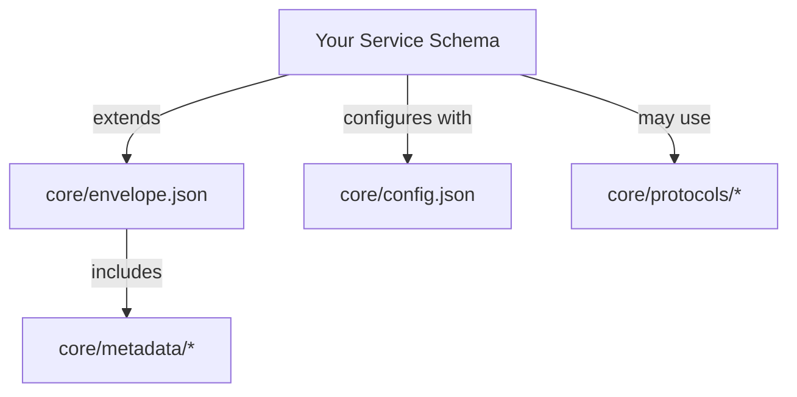

# Qollective Schema Directory

> **Quick Navigation Guide to All Qollective JSON Schemas**

This directory contains all JSON Schema definitions for the Qollective framework. Schemas are organized by purpose with human-friendly naming for easy discovery.

## 📁 Directory Structure

```
schemas/
├── core/                   # Core framework schemas
│   ├── envelope.json      # Main envelope wrapper (THE foundational schema)
│   ├── config.json        # Qollective configuration schema
│   ├── service-config.json# Service-level configuration
│   ├── metadata/          # Envelope metadata sections
│   │   ├── debug.json     # Debug information schema
│   │   ├── monitoring.json# Infrastructure monitoring schema
│   │   ├── performance.json# Performance metrics schema
│   │   ├── security.json  # Security context schema
│   │   └── tracing.json   # Distributed tracing schema
│   └── protocols/         # Protocol-specific schemas
│       └── rest.json      # REST protocol metadata
├── examples/              # Example service schemas
│   └── minimal-service.json
└── SCHEMA.md             # Comprehensive schema writing guide
```

## 🎯 Quick Schema Reference

### Essential Schemas

| Schema | Path | Purpose |
|--------|------|---------|
| **Envelope** | `core/envelope.json` | The foundational schema that ALL services must extend |
| **Config** | `core/config.json` | Defines the `qollective` configuration section |
| **Service Config** | `core/service-config.json` | Service-level configuration options |

### Metadata Schemas

These define the optional metadata sections within the envelope:

| Schema | Path | Purpose |
|--------|------|---------|
| **Debug** | `core/metadata/debug.json` | Debug information (dev only) |
| **Monitoring** | `core/metadata/monitoring.json` | Server, datacenter, deployment info |
| **Performance** | `core/metadata/performance.json` | Performance metrics and timings |
| **Security** | `core/metadata/security.json` | Auth, permissions, tenant context |
| **Tracing** | `core/metadata/tracing.json` | OpenTelemetry distributed tracing |

### Protocol Schemas

Protocol-specific metadata extensions:

| Schema | Path | Purpose |
|--------|------|---------|
| **REST** | `core/protocols/rest.json` | REST-specific metadata (method, path, etc.) |

### Example Schemas

| Schema | Path | Purpose |
|--------|------|---------|
| **Minimal Service** | `examples/minimal-service.json` | Simplest possible service schema |

## 🚀 How to Use These Schemas

### 1. Creating a New Service Schema

Every service schema MUST:
1. Extend the core envelope schema
2. Define payload types in `$defs`
3. Include qollective configuration

```json
{
  "$schema": "https://json-schema.org/draft/2020-12/schema",

  "allOf": [
    { "$ref": "./core/envelope.json" }  // Or use absolute URL
  ],

  "$defs": {
    "YourRequestType": { /* ... */ },
    "YourResponseType": { /* ... */ }
  },

  "qollective": {
    "version": "1.0.0",
    "envelope": { "enabled": true }
  }
}
```

### 2. Understanding Schema Relationships



### 3. Common Use Cases

#### Basic Service
- Extend: `core/envelope.json`
- Configure with: `core/config.json`

#### REST API
- Extend: `core/envelope.json`
- Include: `core/protocols/rest.json`
- Enable metadata: `security`, `tracing`

#### Multi-Protocol Service
- Extend: `core/envelope.json`
- Configure multiple targets in `qollective.generation.targets`
- Protocol-specific metadata auto-selected

## 📖 Schema Documentation

### Detailed Guides
- **[SCHEMA.md](SCHEMA.md)** - Comprehensive guide to writing Qollective schemas
- **[Generator README](../generator/README.md)** - How to generate code from schemas

### Schema Validation

Validate your schema before generating code:
```bash
cd ../generator
cargo run -- validate ../schemas/your-service.json
```

### Code Generation

Generate type-safe code from your schema:
```bash
cargo run -- generate ../schemas/your-service.json \
  --output ../src/generated \
  --language rust
```

## 🔍 Finding the Right Schema

### By Purpose

**"I need to..."**
- Define a new service → Start with `core/envelope.json`
- Configure generation → Reference `core/config.json`
- Add debug info → Include `core/metadata/debug.json`
- Add security context → Include `core/metadata/security.json`
- Track performance → Include `core/metadata/performance.json`
- Enable tracing → Include `core/metadata/tracing.json`
- Monitor infrastructure → Include `core/metadata/monitoring.json`

### By Protocol

**"I'm building a..."**
- REST API → Use `core/protocols/rest.json`
- gRPC Service → (Coming soon: `core/protocols/grpc.json`)
- WebSocket → (Coming soon: `core/protocols/websocket.json`)
- NATS → (Coming soon: `core/protocols/nats.json`)
- MCP → (Coming soon: `core/protocols/mcp.json`)
- A2A → (Coming soon: `core/protocols/a2a.json`)

## 🏗️ Schema Design Principles

1. **Envelope-First**: All data wrapped in the standard envelope
2. **Human-Friendly**: Clear, intuitive naming conventions
3. **Composable**: Schemas build on each other
4. **Protocol-Agnostic**: Same schema works across all protocols
5. **Type-Safe**: Strong typing for compile-time safety

## 🔧 Maintenance

When adding new schemas:
1. Place in appropriate directory
2. Use clear, descriptive names
3. Update this README
4. Add to generator tests
5. Document in SCHEMA.md if needed

## 📚 Related Documentation

- [Qollective README](../../README.md) - Main project documentation
- [Generator README](../generator/README.md) - Code generation tool
- [SCHEMA.md](SCHEMA.md) - Detailed schema writing guide
- [Examples](../examples/) - Example implementations

---

*Remember: The envelope schema (`core/envelope.json`) is the foundation of everything in Qollective. Start there.*